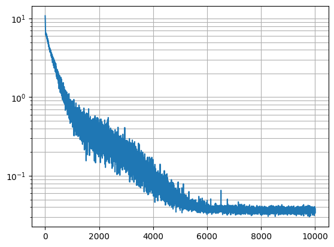

# nnx-gru
A [`jax`](https://jax.readthedocs.io/en/latest)/[`nnx`](https://flax.readthedocs.io/en/latest/why.html) implementation of the 2024 
paper ["Were RNNs All We Needed?"](https://arxiv.org/abs/2410.01201) by Feng and collaborators.

## Why revisit RNNs?
The KV cache in autoregressive Transformers maintains all previous hidden states and exposes them to the computation of the 
current hidden state. The cache size grows linearly with the sequence length, and the time complexity for each successive 
prediction grows at the same rate, resulting in asymptotically quadratic time complexity in the sequence length. 

By contrast, RNNs' hidden state is a constant size, and the time complexity of each prediction is constant in the sequence length 
(for overall linear time complexity). This gives RNNs an inherent performance advantage over Transformers for sequence generation, 
especially when the sequence length is very long: for a sufficiently long sequence, the memory required for a Transformer's KV cache 
can exceed the available resources, while an RNN's hidden state size can be tuned independently of the sequence length. 

This limitation of autoregressive Transformers has thwarted their application to data modalities with very long
sequence lengths such as raw audio and video. Successful Transformer-based techniques for those modalities 
employ some form of compression and quantization along the sequence axis, such as with a [VQ-VAE](https://github.com/jkyl/vq-vae),
and/or are not autoregressive in the time domain at all. In these cases, at least, RNNs may provide a leg up over Transformers.

## Why haven't we done this sooner?
Self-attention consists mainly of matrix-matrix products that are parallelizable along the sequence axis, during both forward and
backward passes. On the other hand, RNNs with recurrent nonlinearities (i.e. those with $h_t$ nonlinear in $h_{t-1}$)
must be unrolled sequentially.

In [arXiv:1709.04057, Martin and Cundy](https://arxiv.org/abs/1709.04057) showed that _linear_ recurrent neural networks can be
unrolled in _parallel_, and provide a custom CUDA kernel for a parallel scan. [Subsequent work by Smith et al.](https://arxiv.org/abs/2208.04933)
applied this technique to the emerging state-space model species of RNN. Since then, works by [Orvieto et al.](https://arxiv.org/abs/2303.06349)
and [De et al.](https://arxiv.org/abs/2402.19427) have expanded the design frontier of linear recurrent neural networks. The JAX 
library exposes a generic [`associative_scan`](https://jax.readthedocs.io/en/latest/_autosummary/jax.lax.associative_scan.html) 
function that targets multiple hardware backends. 

While [Feng et al.](https://arxiv.org/abs/2410.01201) seem to have missed some of these works in their bibliography, they do present
a parallel-scan-friendly version of [GRU](https://arxiv.org/abs/1406.1078) by removing the gates' dependence on previous hidden states, 
and by removing the recurrent nonlinearity. Surprisingly, they find this minimal GRU can solve the synthetic "selective copy"
task as well as compete with Transformers and [Mamba](https://arxiv.org/abs/2312.00752) in a contrived language modelling example. 

## What are the goals of this implementation?
1. To provide an object lesson in the relatively new `nnx` API
2. To explore the design space of linear recurrent neural networks and to get a sense of their capabilities firsthand
3. To dip a toe into generative language modelling, an area that I don't often work in at my job

## How does this implementation work?
Following the code provided by [Orvieto et al.](https://arxiv.org/pdf/2303.06349#page=17) and [the official implementation of RecurrentGemma](https://github.com/google-deepmind/recurrentgemma/blob/8a32e3657ad34a1ce35a4577558239c1c0b65644/recurrentgemma/jax/scan.py#L150-L204), 
we implement the parallel scan using `jax.lax.associative_scan` and a binary associative operator:
```python
@jax.vmap
def binary_operator_diag(q_i, q_j):
    (A_i, b_i), (A_j, b_j) = q_i, q_j
    return A_j * A_i, A_j * b_i + b_j

def parallel_scan(a, b, v_0):
    a = jnp.concatenate([jnp.zeros((1, *a.shape[1:]), dtype=a.dtype), a])
    b = jnp.concatenate([v_0[None], b])
    _, v_t = jax.lax.associative_scan(binary_operator_diag, (a, b))
    return v_t[1:]
```
This defines the parallel linear recurrence over the leading axes of `a` and `b`! It also enables us to supply `v_0`, the initial value of 
the recurrence (usually set to zero). We then define two GRU modules, a parallel one, and a sequential one:
```python
class GRUBase(nnx.Module):

    def __init__(self, dim: int, rngs: nnx.Rngs):
        self.linear_z = nnx.Linear(dim, dim, param_dtype=default_dtype, rngs=rngs)
        self.linear_h = nnx.Linear(dim, dim, param_dtype=default_dtype, rngs=rngs)

    def __call__(self, x: jax.Array) -> tuple[jax.Array, jax.Array]:
        z = nnx.sigmoid(self.linear_z(x))
        h_tilde = self.linear_h(x)
        return z, h_tilde

class ParallelGRU(GRUBase):

    @nnx.vmap(in_axes=(None, 0, 0), out_axes=0)
    def __call__(self, x: jax.Array, h_prev: jax.Array) -> jax.Array:
        z, h_tilde = super().__call__(x)
        h = parallel_scan(1 - z, z * h_tilde, h_prev)
        return h

class SequentialGRU(GRUBase):

    def __call__(self, x: jax.Array, h_prev: jax.Array) -> jax.Array:
        z, h_tilde = super().__call__(x)
        h = (1 - z) * h_prev + z * h_tilde
        return h
```
Note that the parallel model is vmapped over the leading axis so that it can be batched without having to 
modify the parallel scan over the sequence axis. The sequential model is applied "pointwise" and
so already functions properly on batched or unbatched inputs. Next we combine the GRU with a [GLU](https://arxiv.org/abs/1612.08083)
and add a residual connection:
```python
class ResBlock(nnx.Module):

    def __init__(self, dim: int, gru: type, *, rngs: nnx.Rngs):
        self.gru = gru(dim, rngs=rngs)
        self.linear = nnx.Linear(dim, 2 * dim, param_dtype=default_dtype, rngs=rngs)

    def __call__(self, x: jax.Array, h_prev: jax.Array) -> tuple[jax.Array, jax.Array]:
        h = self.gru(x, h_prev)
        x += nnx.glu(self.linear(h))
        return x, h
```
This is a bit of a deviation from Transformers which typically use a 2-layer MLP, position-wise normalization, and residual 
connections both before and after the MLP, but it is more than sufficient for our task, as we will see. This next step uses
a bit of JAX/NNX magic to create and apply a deep stack of residual blocks without any Python looping, saving compilation time:
```python
class Backbone(nnx.Module):

    def __init__(self, depth: int, dim: int, gru: type, *, rngs: nnx.Rngs):

        @nnx.split_rngs(splits=depth)
        @nnx.vmap
        def create_block(rngs: nnx.Rngs):
            return ResBlock(dim, gru, rngs=rngs)

        self.layers = create_block(rngs)
        self.depth = depth
        self.dim = dim

    def __call__(self, x: jax.Array, h_prev: jax.Array) -> tuple[jax.Array, jax.Array]:

        @nnx.scan(in_axes=(nnx.Carry, 0, 0), out_axes=(nnx.Carry, 0))
        def forward(x, h_prev, backbone):
            return backbone(x, h_prev)

        return forward(x, h_prev, self.layers)
```
Here the `create_block` function is vmapped over RNGs, so a single invocation creates a stack of blocks. The `forward` function
is scanned over the stack of blocks, carrying the output from one layer to the next. To finish it all off, we wrap this backbone
in an embedding and a logit layer:
```python
class Model(nnx.Module):

    def __init__(self, vocab_size: int, depth: int, dim: int, gru: type, *, rngs: nnx.Rngs):
        self.embeddings = nnx.Embed(vocab_size, dim, param_dtype=default_dtype, rngs=rngs)
        self.backbone = Backbone(depth, dim, gru, rngs=rngs)
        self.linear_out = nnx.Linear(dim, vocab_size, param_dtype=default_dtype, rngs=rngs)
        self.vocab_size = vocab_size
        self.depth = depth
        self.dim = dim

    def __call__(self, x: jax.Array, h_prev: jax.Array) -> tuple[jax.Array, jax.Array]:
        x = self.embeddings(x)
        x, h = self.backbone(x, h_prev)
        x = self.linear_out(x)
        return x, h
```
Now we have a common constructor for both parallel and sequential models, and we can freely share state between them using
`nnx.eval_shape`, `nnx.split`, and `nnx.update`:
```python
class ParallelModel(Model):
    def __init__(self, *, vocab_size: int, depth: int, dim: int, rngs: nnx.Rngs):
        super().__init__(vocab_size, depth, dim, ParallelGRU, rngs=rngs)

class SequentialModel(Model):
    def __init__(self, *, vocab_size: int, depth: int, dim: int, rngs: nnx.Rngs):
        super().__init__(vocab_size, depth, dim, SequentialGRU, rngs=rngs)

def to_sequential(parallel_model: ParallelModel) -> SequentialModel:
    sequential_model = nnx.eval_shape(
        lambda: SequentialModel(
            vocab_size=parallel_model.vocab_size,
            depth=parallel_model.depth,
            dim=parallel_model.dim,
            rngs=nnx.Rngs(0)
        )
    )
    _, state = nnx.split(parallel_model)
    nnx.update(sequential_model, state)
    return sequential_model
```
We train the model using autoregressive cross-entropy, but no need for pesky masking like in Transformers:
```python
@nnx.jit
def train_step(model: ParallelModel, optimizer: nnx.Optimizer, batch: jax.Array) -> jax.Array:
    inputs, targets = batch[:, :-1], batch[:, 1:]
    initial_state = jnp.zeros((model.depth, inputs.shape[0], model.dim), default_dtype)

    @nnx.value_and_grad
    def loss_fn(model):
        logits, _ = model(inputs, initial_state)
        loss = optax.softmax_cross_entropy_with_integer_labels(logits, targets).mean()
        return loss

    loss, grads = loss_fn(model)
    optimizer.update(grads)
    return loss
```
An added benefit of the linear recurrence is that it allows us to "prefill" tokens (i.e. compute the final hidden state for a sequence)
in parallel, as we would a Transformer:
```python
@nnx.jit
def prefill(model: ParallelModel, tokens: jax.Array) -> tuple[jax.Array, jax.Array]:
    initial_state = jnp.zeros((model.depth, tokens.shape[0], model.dim), default_dtype)
    logits, state = model(tokens, initial_state)
    final_logits = logits[..., -1, :]
    final_state = state[..., -1, :]
    return final_logits, final_state
```
Finally, we can define the autoregressive recurrence:
```python
@nnx.jit
def sample(
    model: SequentialModel,
    token: jax.Array,
    state: jax.Array,
    *,
    temperature: float,
    rng: jax.Array,
) -> tuple[jax.Array, jax.Array]:
    logits, state = model(token, state)
    token = jax.random.categorical(rng, logits / temperature)
    return token, state
```
We train a 300M-parameter model on a few million tokens of English literature, to test its expressivity. We find that it 
converges quickly on a single A100, within 10,000 steps:



It is happy to regurgitate long sections of its training data when prompted:
```python
rng = nnx.Rngs(0)
temperature = 0.5
prompt = "ROMEO."
prompt_tokens = tokenizer(prompt, return_tensors="jax").input_ids
logits, state = prefill(parallel_model, prompt_tokens)
sequential_model = to_sequential(parallel_model)
token = jax.random.categorical(rng(), logits / temperature)
streamer = TextStreamer(tokenizer, skip_special_tokens=True)
streamer.put(prompt_tokens)
streamer.put(token)
for step in range(512):
    token, state = sample(sequential_model, token, state, temperature=temperature, rng=rng())
    streamer.put(token)
streamer.end()
```
> ROMEO.
> A torch for me: let wantons, light of heart,
> Tickle the senseless rushes with their heels;
> For I am proverb’d with a grandsire phrase,
> I’ll be a candle-holder and look on,
> The game was ne’er so fair, and I am done.
> 
> MERCUTIO.
> Tut, dun’s the mouse, the constable’s own word:
> If thou art dun, we’ll draw thee from the mire
> Or save your reverence love, wherein thou stickest
> Up to the ears. Come, we burn daylight, ho.
> 
> ROMEO.
> Nay, that’s not so.
> 
> MERCUTIO.
> I mean sir, in delay
> We waste our lights in vain, light lights by day.
> Take our good meaning, for our judgment sits
> Five times in that ere once in our five wits.
> 
> ROMEO.
> And we mean well in going to this mask;
> But ’tis no wit to go.
> 
> MERCUTIO.
> Why, may one ask?
> 
> ROMEO.
> I dreamt a dream tonight.
> 
> MERCUTIO.
> And so did I.
> 
> ROMEO.
> Well what was yours?
> 
> MERCUTIO.
> That dreamers often lie.
> 
> ROMEO.
> In bed asleep, while they do dream things true.
> 
> MERCUTIO.
> O, then, I see Queen Mab hath been with you.
> She is the fairies’ midwife, and she comes
> In shape no bigger than an agate-stone
> On the fore-finger of an alderman,
> Drawn with a team of little atomies
> Over men’s noses as they lie asleep:
> Her waggon-spokes made of long spinners’ legs;
> The cover, of the wings of grasshoppers;
> Her traces, of the smallest spider’s web;
> The collars, of the moonshine’s watery beams;
> Her whip of cricket�
